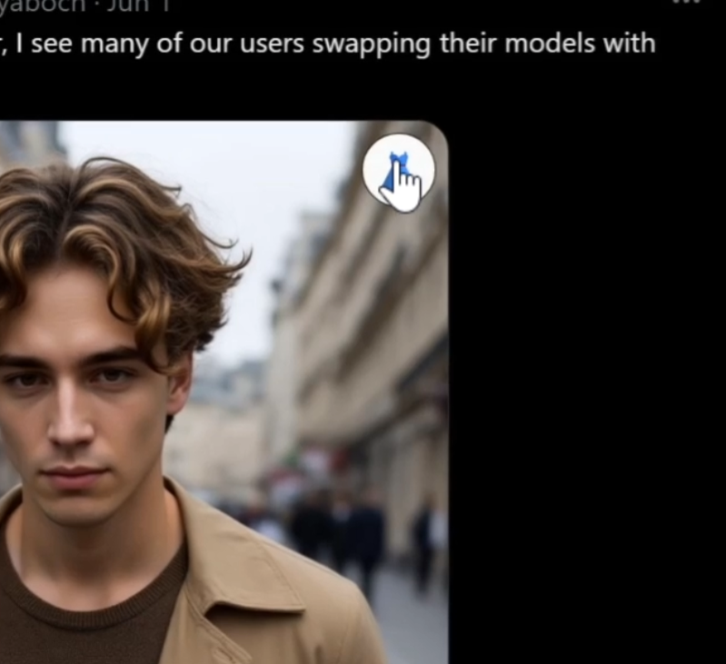
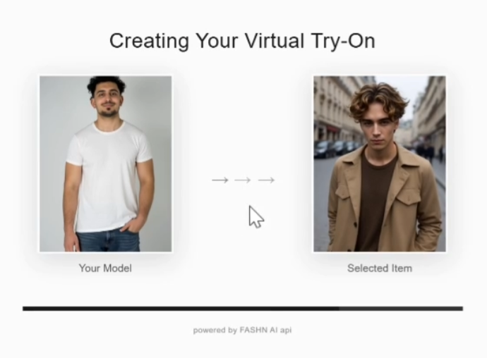
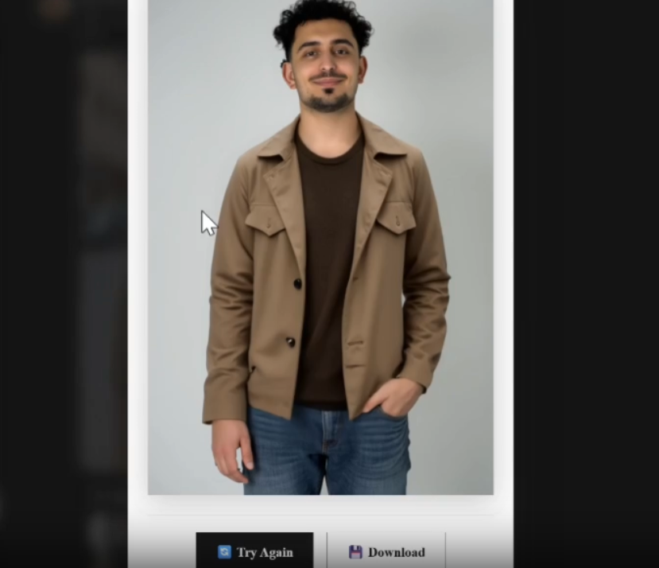

# 👗 FASHN AI Try-On Chrome Extension

A Chrome extension that enables virtual fashion try-on using FASHN AI technology. Simply hover over clothing images on any website to try them on virtually with your uploaded model image.

## 🎥 Demo

See the extension in action:
| Try-On Button | Loading Screen | Result |
|---|---|---|
|  |  |  |

*Hover over clothing images on any website to activate the virtual try-on feature*


## ✨ Features

### 🎯 Core Functionality
- **Virtual Try-On**: Hover over clothing images on any website to see the 👗 try-on button
- **Real-time Processing**: Advanced AI processing with progress tracking and prediction IDs
- **Universal Compatibility**: Works on any e-commerce or fashion website
- **High-Quality Results**: Professional-grade virtual try-on powered by FASHN AI

### 🎨 User Interface
- **Modern Design**: Clean, sharp rectangular design with Metrophobic typography
- **Circular Try-On Button**: Easy-to-recognize 👗 button that appears on hover
- **Loading Animation**: Beautiful loading screen with animated arrows and progress bar
- **Result Actions**: Try Again 🔄 and Download 💾 buttons for each result

### 🔧 Configuration
- **Model Image Upload**: Upload your own model image (up to 5MB, PNG/JPEG/WebP)
- **API Key Management**: Secure storage of your FASHN AI API key
- **Settings Panel**: Easy-to-use options page for configuration
- **Storage Persistence**: Your settings are saved across browser sessions

### 🛠️ Technical Features
- **Fast Development**: Built with Vite, React, TypeScript, and Tailwind CSS
- **Manifest V3**: Latest Chrome extension standard
- **CORS Handling**: Robust image fetching and blob-based downloads
- **Error Handling**: Comprehensive error messages and retry mechanisms
- **Debug Support**: Built-in console logging for troubleshooting

## 🚀 Installation

### Prerequisites
- Node.js and npm installed
- FASHN AI API key from [FASHN AI Settings](https://app.fashn.ai/api)

### Setup Steps

1. **Clone the repository:**
   ```bash
   git clone https://github.com/parsakhaz/fashn-tryon-extension
   cd fashn-tryon-extension
   ```

2. **Install dependencies:**
   ```bash
   npm install
   ```

3. **Build the extension:**
   ```bash
   npm run build
   ```

4. **Load in Chrome:**
   - Open `chrome://extensions/` in your browser
   - Enable `Developer mode`
   - Click `Load unpacked` and select the `dist` folder

## ⚙️ Configuration

### First-Time Setup
1. Click the 👗 extension icon in your Chrome toolbar
2. Click "Complete Setup" to open the options page
3. Upload a clear, front-facing model image (max 5MB)
4. Enter your FASHN AI API key
5. Save your settings

### Getting Your API Key
1. Visit [FASHN AI Settings](https://app.fashn.ai/api)
2. Create an account or log in
3. Generate your API key (format: `fa-xxxxxxxxxxxxxxxxxxxxxxxxxxxxxx`)
4. Copy and paste it into the extension options

## 🎮 How to Use

1. **Navigate** to any fashion or e-commerce website
2. **Hover** over clothing images to reveal the 👗 try-on button
3. **Click** the try-on button to start the virtual try-on process
4. **Wait** for the AI to process your request (typically 30-60 seconds)
5. **View** your try-on result in the modal
6. **Use** the action buttons:
   - 🔄 **Try Again**: Start another try-on with the same garment
   - 💾 **Download**: Save the result image to your computer

## 🏗️ Development

### Project Structure
```
src/
├── chrome-extension/
│   ├── popup/           # Extension popup UI
│   ├── options/         # Settings page
│   ├── global.css       # Global styles with Metrophobic font
│   └── manifest.json    # Extension manifest
├── content.ts           # Content script for try-on functionality
├── content.css          # Styles for try-on UI
└── background.ts        # Background service worker
```

### Development Commands
```bash
# Start development server with hot reload
npm run dev

# Build for production
npm run build

# Type checking
npm run type-check
```

### Making Changes
1. Edit source files in the `src` directory
2. Run `npm run build` to compile changes
3. Go to `chrome://extensions/` and click refresh ⟳ on your extension
4. Test your changes

## 🎨 Design System

### Colors
- Primary: `#1A1A1A` (Dark)
- Secondary: `#333333` (Medium Gray)
- Background: `#FAFAFA` (Light Gray)
- Success: `#0F766E` (Teal)
- Warning: `#92400E` (Amber)

### Typography
- Font: **Metrophobic** (Clean, modern sans-serif)
- Consistent font weights and letter spacing throughout

### UI Elements
- **Sharp Design**: Rectangular elements with no border-radius (except try-on button)
- **Circular Try-On Button**: 50% border-radius for easy recognition
- **Consistent Spacing**: Tailwind CSS utility classes for spacing

## 🔧 Advanced Configuration

### API Settings
The extension supports various FASHN AI parameters:
- **Garment Photo Type**: Auto-detected
- **Category**: Auto-detected
- **Mode**: Balanced (default)
- **Samples**: 1 result per try-on

### Storage
Extension data is stored locally using Chrome's storage API:
- `modelImageBase64`: Your uploaded model image
- `fashnApiKey`: Your FASHN AI API key

## 🐛 Troubleshooting

### Common Issues

**Try-on button not appearing:**
- Make sure you're hovering over actual clothing images
- Check that the extension is enabled in Chrome
- Verify your model image and API key are set

**API errors:**
- Verify your API key is correct and active
- Check your FASHN AI account quota
- Ensure the image URLs are accessible

**Download not working:**
- The extension uses blob downloads to handle CORS
- Check browser permissions for file downloads

### Debug Mode
The extension includes console logging for debugging:
- Open Developer Tools (F12)
- Check the Console tab for detailed logs
- Look for messages prefixed with "Popup:", "Options:", or "Background:"

## 🤝 Contributing

1. Fork the repository
2. Create a feature branch (`git checkout -b feature/amazing-feature`)
3. Make your changes
4. Build and test the extension
5. Commit your changes (`git commit -m 'Add amazing feature'`)
6. Push to the branch (`git push origin feature/amazing-feature`)
7. Open a Pull Request

## 📄 License

This project is licensed under the MIT License - see the [LICENSE](LICENSE) file for details.

## 🙏 Acknowledgments

- [FASHN AI](https://fashn.ai) for providing the virtual try-on API
- Built with modern web technologies: Vite, React, TypeScript, Tailwind CSS
- Chrome Extension Manifest V3 specifications

---

**Ready to revolutionize your online shopping experience? Install the FASHN AI Try-On extension and try on clothes virtually before you buy!** 👗✨
